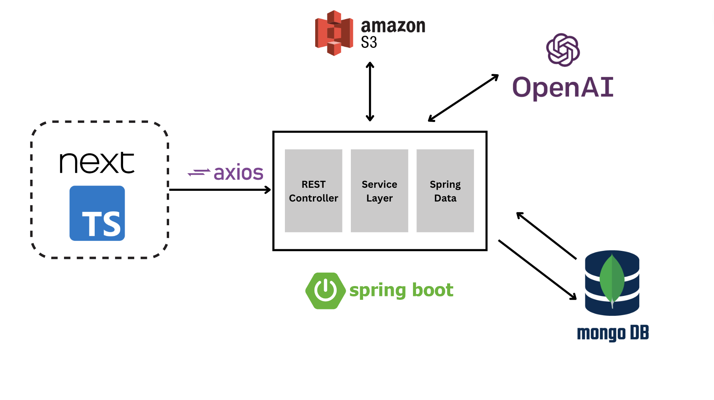
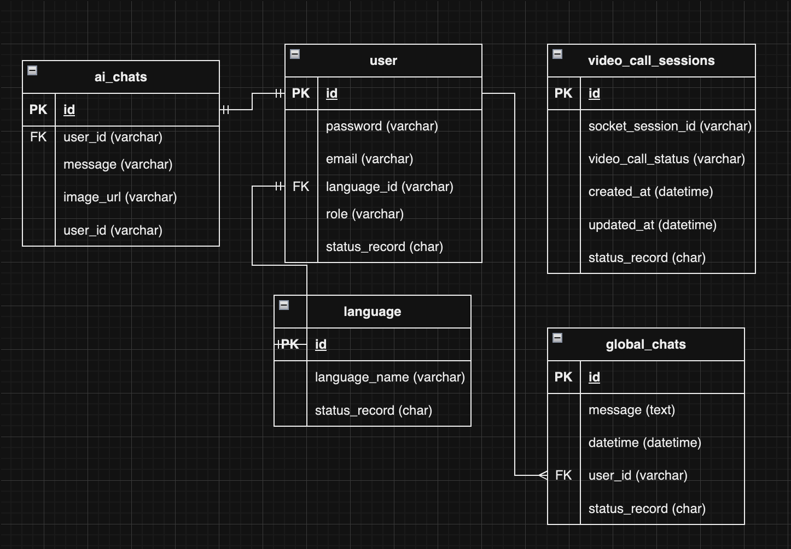
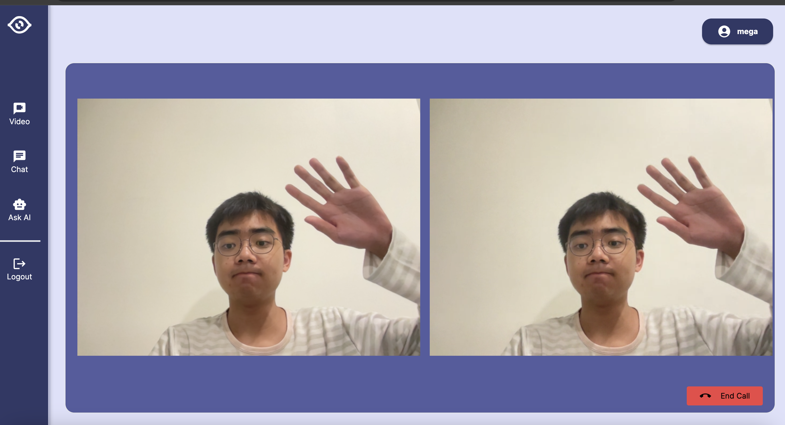
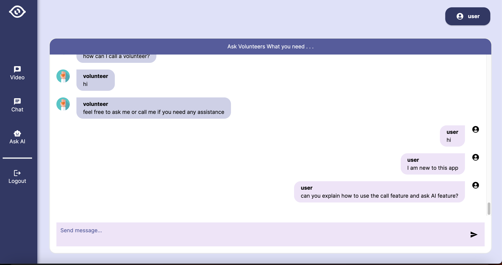
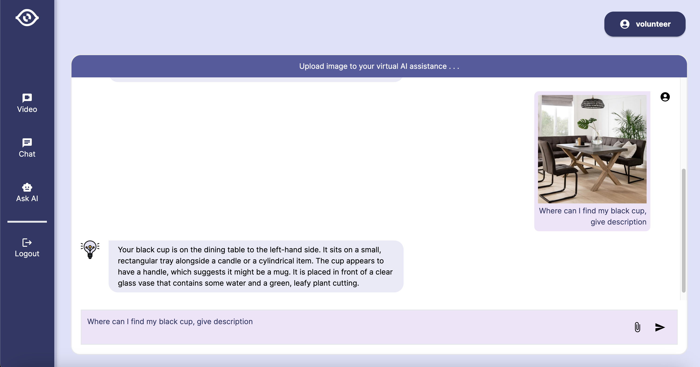

# ShareMySight-Backend

Welcome to ShareMySight - Connecting the Visually Impaired with Volunteers!

Backend Repo - [link](https://github.com/BryMat24/ShareMySight-Backend)

## Table of Contents

-   [Introduction](#introduction)
-   [Main Features](#main-features)
-   [Technologies Used](#technologies-used)
-   [Installation](#installation)

## Introduction

ShareMySight is a revolutionary application designed to bridge the gap between visually impaired individuals and volunteers who are eager to assist. The app leverages voice calls, chat assistance, and a generative AI to enhance the visual experience for those with impaired vision.

## Main Features

1. **Connect with Volunteers:**

    - Easily connect with volunteers through voice calls for real-time assistance.

2. **Chat Assistant:**

    - Engage in text-based conversations with volunteers who can provide support, answer questions, and offer guidance.

3. **Generative AI Image Descriptions:**
    - Utilize our advanced generative AI to receive detailed descriptions of images, enhancing the understanding of visual content.

## Technologies Used

-   **Voice Calls:** WebRTC
-   **Chat Assistance:** WebSocket
-   **Generative AI:** Open AI Vision API
-   **User Interface:** NextTS, TailwindCSS
-   **Backend:** Springboot
-   **Database:** MongoDB
-   **Authentication:** JSON Web Tokens (JWT)
-   **Image Upload:** AWS S3

## Application Architecture

## Database Schema

## Demo Overview

